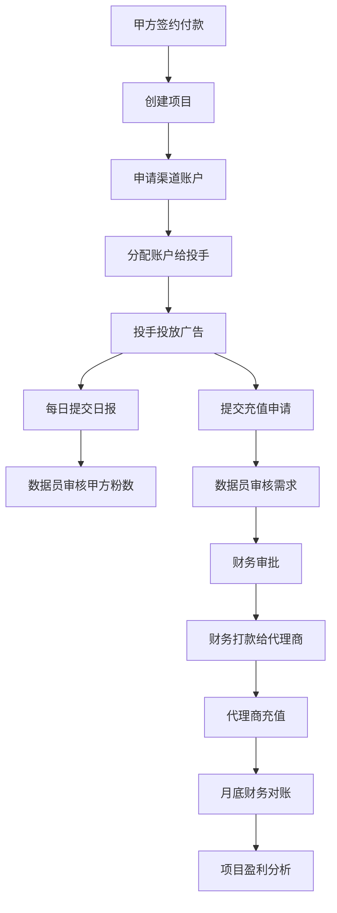
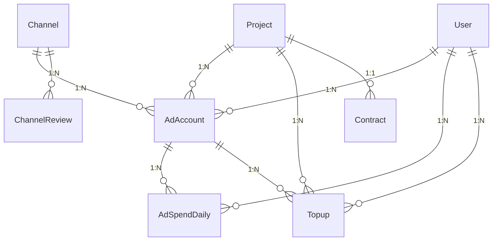

# AI财务与投手管理系统需求文档

> **项目名称**: AI财务与投手管理系统
> **业务类型**: Facebook广告代投服务
> **文档版本**: v1.0
> **创建日期**: 2025-11-10
> **业务负责人**: 广告代投公司

---

## 📋 业务模式概述

### 1. 公司简介
我们是一家专业的Facebook广告代投公司，为甲方客户提供广告投放服务。主要业务模式是通过收取项目启动费，并根据帮助甲方带来的潜在客户数量进行计费。

### 2. 核心业务规则和流程

#### 2.1 核心业务关系
- **项目-渠道-账户关系**：一个项目下可以挂多个渠道提供的广告账户
- **投手账户分配**：一个投手可以管理多个广告账户
- **数据追溯链**：所有数据必须能反向追溯到"项目+渠道+账号+投手"

#### 2.2 潜在客户（粉）管理
**定义和统计规则**：
- **统一术语**：潜在客户统一用"粉"指代
- **数量确定**：粉数最终由甲方反馈决定，不是系统自动统计
- **数据来源**：通过表单提交的潜在客户
- **统计维度**：只分项目和投手维度，不区分具体广告账户

**对齐机制**：
- **日常确认**：数据员每天与甲方确认粉数
- **数据录入**：投手提交每日粉数统计
- **差异处理**：识别投手统计vs甲方反馈的差异

#### 2.3 充值流程设计
**简化流程**：
1. **投手申请**：投手直接提交充值需求给数据员
2. **数据员审核**：数据员核对需求合理性，提供账户信息
3. **财务审批**：财务部门审批充值申请
4. **财务执行**：财务打款给代理商
5. **代理商充值**：代理商完成账户充值

**责任分工**：
- **投手**：提交充值需求（账号、金额、用途）
- **数据员**：审核需求，提供代理商账号和广告账号信息
- **财务**：审批充值申请，执行付款和充值操作
- **代理商**：接收款项并完成账户充值

**对账机制**：
- **日报对账**：投手统计vs甲方反馈每日粉数
- **月度财务对账**：月度充值vs消耗对账
- **差异分析**：自动识别差异原因（时间差、手续费、系统延迟等）

#### 2.4 更新的业务流程图


#### 2.5 实际操作流程详情

**投手日常工作流程**：
1. 每天登录系统录入当日工作数据
2. 提交日报：选择项目，输入广告消耗金额和粉数
3. 系统自动计算效率指标（如CPL等）
4. 根据账户余额情况提交充值申请

**数据员审核流程**：
1. 审核投手提交的日报数据完整性和准确性
2. 与甲方确认粉数，更新客户信息
3. 审核充值申请的合理性
4. 为财务提供账户和代理商信息

**财务审批流程**：
1. 审核充值申请的金额和用途
2. 确认账户状态和余额需求
3. 执行付款给代理商
4. 确认充值完成并更新账户余额

**对账流程**：
- **每日对账**：数据员核对投手统计和甲方反馈的粉数
- **月度对账**：财务核对月度充值总额和实际消耗总额
- **差异分析**：分析充值vs消耗偏差的原因和解决方案
- **报告生成**：生成详细的对账分析报告

### 3. 收入模式
- **项目启动费**: 项目开始前收取的固定费用
- **按潜在客户计费**: 根据带来的潜在客户数量计费（单粉价格因国家和项目而异）
- **主要收入来源**: 项目收费

### 4. 成本结构
- **广告费消耗**: 主要成本，投手实际消耗的广告费用
- **充值手续费**: 广告代理商收取，范围5%-20%
- **开户费**: 部分账户需要的开户费用
- **Facebook账号成本**: 账户采购和维护费用
- **公共主页费用**: 相关页面维护费用
- **服务器费用**: 系统运行成本
- **投手工资**: 人力成本

### 5. 管理挑战
- **投手效率管理**: 缺乏有效的绩效考核和实时监控
- **财务对账困难**: 充值申请审批流程混乱，消耗与充值对账不清晰
- **渠道管理复杂**: 多个广告代理商质量参差不齐，缺乏渠道绩效评估
- **盈利分析不清晰**: 无法准确评估项目盈利状况
- **账户生命周期管理**: 广告账户寿命不确定（几天到几个月不等）

---

## 🎯 系统功能需求

### 1. 核心业务模块

#### 1.1 项目管理模块
**目标**: 管理甲方项目信息和收费模式

**功能需求**:
- ✅ 项目创建、编辑、删除
- ✅ 项目状态管理（规划中、进行中、暂停、完成、取消）
- ✅ 客户信息管理（客户名称、联系方式、合同信息）
- ✅ 收费模式配置（按潜在客户计费、固定费用、混合模式）
- ✅ 单粉价格设置（支持不同国家不同价格）
- ✅ 项目启动费管理
- ✅ 预算管理（月度预算、总预算）
- ✅ 目标设定（月度目标客户数、目标单粉成本）

**数据模型**:
- Project（项目表）
- Contract（合同表）
- ProjectTarget（项目目标表）
- ProjectMetrics（项目指标表）

#### 1.2 渠道管理模块
**目标**: 管理多个广告代理商和渠道质量

**功能需求**:
- ✅ 代理商信息管理（公司信息、联系方式）
- ✅ 服务费率配置（5%-20%）
- ✅ 开户费设置
- ✅ 渠道质量评估（质量评分、可靠性评分）
- ✅ 账户申请流程管理
- ✅ 渠道表现统计分析
- ✅ 渠道评价和反馈系统
- ✅ 费用结构详细记录

**数据模型**:
- Channel（渠道表）
- ChannelReview（渠道评价表）
- ChannelAccountRequest（渠道账户申请表）
- ChannelPerformance（渠道表现表）
- ChannelContact（渠道联系人表）

#### 1.3 广告账户管理模块
**目标**: 全生命周期管理Facebook广告账户

**功能需求**:
- ✅ 账户申请和分配流程
- ✅ 账户状态管理（new→testing→active→suspended→dead→archived）
- ✅ 账户生命周期跟踪
- ✅ 账户与投手关联管理
- ✅ 预算监控和预警
- ✅ 账户性能分析
- ✅ 开户费记录和支付状态
- ✅ 账户文档管理（合同、截图、报告等）
- ✅ 账户备注和重要信息记录

**数据模型**:
- AdAccount（广告账户表）
- AccountStatusHistory（账户状态历史表）
- AccountPerformance（账户表现表）
- AccountAlert（账户预警表）
- AccountDocument（账户文档表）
- AccountNote（账户备注表）

#### 1.4 用户权限管理模块
**目标**: 管理不同角色用户的权限

**功能需求**:
- ✅ 用户角色定义（投手、户管、财务、管理员）
- ✅ 权限分级控制
- ✅ 用户信息管理
- ✅ 角色权限矩阵
- ✅ 操作权限验证

**用户角色定义**:
- **投手**: 负责广告投放，录入日报数据
- **户管**: 管理广告账户，分配账户给投手，申请账户
- **财务**: 审批充值，管理财务流水
- **管理员**: 系统管理，用户管理

### 2. 财务与对账模块

#### 2.1 日报管理模块
**目标**: 管理投手每日工作数据

**功能需求**:
- ✅ 投手数据录入界面
- ✅ 潜在客户统计（基于表单提交数据）
- ✅ 广告消耗记录
- ✅ 数据员审核确认流程
- ✅ 异常数据标记和处理
- ✅ 日报汇总和统计

**业务流程**:
1. 投手每日登录系统录入基础数据
2. 数据员审核确认数据的准确性
3. 系统自动计算成本和效率指标
4. 异常数据标记并通知相关负责人

#### 2.2 充值管理模块
**目标**: 规范化充值申请和审批流程

**功能需求**:
- ✅ 充值申请流程（投手→户管→财务）
- ✅ 多级审批工作流
- ✅ 充值记录管理
- ✅ 手续费自动计算
- ✅ 充值状态跟踪
- ✅ 充值历史查询

**审批流程**:
1. 投手提交充值申请
2. 户管审核账户状态和申请合理性
3. 财务审批并执行充值
4. 系统记录充值信息和费用

#### 2.3 对账管理模块
**目标**: 解决财务充值与消耗对账偏差问题

**功能需求**:
- ✅ 自动对账功能（充值vs消耗对比）
- ✅ 对账差异识别和分析
- ✅ 对账报告生成
- ✅ 手动对账调整
- ✅ 对账异常处理
- ✅ 历史对账记录查询

**对账逻辑**:
- 考虑时间差和手续费因素
- 自动识别偏差并分析原因
- 生成详细的对账报告
- 支持手动调整和说明

#### 2.4 财务流水模块
**目标**: 记录所有收支流水

**功能需求**:
- ✅ 收入记录管理（项目收费）
- ✅ 支出记录管理（广告费、手续费、开户费等）
- ✅ 多币种支持
- ✅ 成本分类统计
- ✅ 财务报表生成
- ✅ 收支趋势分析

### 3. 数据分析与报表模块

#### 3.1 投手绩效分析
**目标**: 实时监控投手工作表现

**功能需求**:
- ✅ 每日消耗统计
- ✅ 潜在客户成本分析
- ✅ 投手效率排名
- ✅ 工作质量评估
- ✅ 异常数据预警
- ✅ 绩效报表生成

**关键指标**:
- 日均广告消耗
- 单粉成本（CPL）
- 潜在客户数量
- 账户存活率
- 投入产出比

#### 3.2 项目盈利分析
**目标**: 准确计算项目盈利状况

**功能需求**:
- ✅ 收入计算（潜在客户数量 × 单粉价格）
- ✅ 成本分析（广告费 + 手续费 + 其他成本）
- ✅ 项目盈亏报表
- ✅ 盈利趋势分析
- ✅ 成本结构分析
- ✅ ROI计算

**计算公式**:
```
项目收入 = 潜在客户数量 × 单粉价格 + 项目启动费
项目成本 = 广告费消耗 + 充值手续费 + 开户费 + 其他运营成本
项目利润 = 项目收入 - 项目成本
ROI = 项目利润 / 项目成本 × 100%
```

#### 3.3 渠道质量分析
**目标**: 评估和管理广告代理商质量

**功能需求**:
- ✅ 账户存活率统计
- ✅ 渠道效率评估
- ✅ 死户原因分析
- ✅ 服务费率对比分析
- ✅ 渠道推荐建议
- ✅ 渠道表现排名

**关键指标**:
- 7天存活率
- 30天存活率
- 平均账户寿命
- 开户成功率
- 服务费率合理性

---

## 🏗️ 技术架构方案

### 1. 系统架构
```
前端层 (Next.js + TypeScript)
    ↓ REST API
业务逻辑层 (FastAPI + SQLAlchemy)
    ↓ ORM + RLS
数据层 (PostgreSQL + Supabase)
    ↓ 文件存储
文件存储 (Supabase Storage)
```

### 2. 技术栈确认
- **前端**: Next.js 14 + TypeScript + Tailwind CSS
- **后端**: FastAPI + SQLAlchemy + Supabase (PostgreSQL)
- **数据库**: PostgreSQL + Supabase RLS
- **认证**: JWT + Supabase Auth
- **文件服务**: Supabase Storage
- **部署**: 宝塔 + Nginx + PM2

### 3. 安全架构
- **数据安全**: RLS行级安全策略
- **认证授权**: JWT + 角色权限管理
- **操作审计**: 完整的操作日志记录
- **数据加密**: 敏感数据加密存储

---

## 📊 数据模型设计

### 核心实体关系


### 核心数据表

#### 1. 项目相关表
- `projects`: 项目基本信息
- `contracts`: 合同信息
- `project_targets`: 项目目标
- `project_metrics`: 项目实际指标

#### 2. 渠道相关表
- `channels`: 渠道信息
- `channel_reviews`: 渠道评价
- `channel_performance`: 渠道表现数据
- `channel_account_requests`: 账户申请记录

#### 3. 账户相关表
- `ad_accounts`: 广告账户
- `account_status_history`: 状态变更历史
- `account_performance`: 账户表现数据
- `account_alerts`: 账户预警

#### 4. 数据统计表
- `ad_spend_daily`: 每日消耗数据
- `topups`: 充值记录
- `reconciliation`: 对账记录
- `users`: 用户信息

---

## 🎯 业务流程设计

### 1. 项目启动流程
1. 销售与客户签订合同
2. 财务收取项目启动费
3. 创建项目并设置收费参数
4. 分配项目经理

### 2. 账户获取流程
1. 户管评估项目需求
2. 选择合适的广告代理商
3. 提交账户申请
4. 代理商审核并分配账户
5. 记录开户费并支付

### 3. 投手工作流程
1. 项目经理分配广告账户给投手
2. 投手开始广告投放
3. 每日录入消耗和潜在客户数据
4. 数据员审核确认数据
5. 系统自动分析表现指标

### 4. 充值审批流程
1. 投手根据账户余额提交充值申请
2. 户管审核申请的合理性和紧急性
3. 财务审批并执行充值
4. 记录充值费用和手续费
5. 更新账户余额

### 5. 对账分析流程
1. 系统自动对比充值和消耗数据
2. 识别和分析对账差异
3. 生成对账报告
4. 财务确认对账结果
5. 必要时进行手动调整

---

## 📈 功能特色和创新点

### 1. 智能对账系统
- **自动对账**: 智能匹配充值和消耗数据
- **差异分析**: 自动识别偏差原因（时间差、手续费等）
- **对账报告**: 生成详细的对账分析报告
- **异常预警**: 对账差异超过阈值时自动预警

### 2. 投手绩效管理
- **实时监控**: 投手工作数据实时更新
- **绩效评分**: 多维度评估投手表现
- **异常检测**: 自动识别异常数据和行为
- **排名激励**: 投手绩效排名和激励机制

### 3. 账户生命周期管理
- **状态监控**: 实时监控账户状态变化
- **寿命预测**: 基于历史数据预测账户寿命
- **风险评估**: 识别高风险账户
- **自动提醒**: 账户状态变更自动提醒

### 4. 项目盈利分析
- **精准核算**: 准确计算项目收入和成本
- **多维度分析**: 按时间、项目、投手等多维度分析
- **趋势预测**: 基于历史数据预测盈利趋势
- **决策支持**: 为业务决策提供数据支持

---

## 🔧 系统集成方案

### 1. 现有系统集成
- **财务系统**: 与现有财务软件对接
- **广告平台**: Facebook API集成（可选）
- **客服系统**: 客户信息同步

### 2. 第三方服务
- **支付系统**: 支持多种支付方式
- **短信服务**: 重要通知短信提醒
- **邮件服务**: 定期报表邮件发送

### 3. 数据导出
- **Excel导出**: 支持各类报表导出
- **API接口**: 提供数据接口供第三方使用
- **报表订阅**: 定期报表自动推送

---

## 📋 开发计划

### 第一阶段：核心业务功能（2-3周）
- ✅ 项目管理模块
- ✅ 渠道管理模块
- ✅ 广告账户管理模块
- ✅ 用户权限管理模块

### 第二阶段：财务与对账（2-3周）
- ✅ 日报管理模块
- ✅ 充值管理模块
- ✅ 对账管理模块
- ✅ 财务流水模块

### 第三阶段：数据分析与报表（2-3周）
- ✅ 投手绩效分析
- ✅ 项目盈利分析
- ✅ 渠道质量分析
- ✅ 综合报表功能

### 第四阶段：系统优化与部署（1-2周）
- ✅ 性能优化
- ✅ 安全加固
- ✅ 监控运维
- ✅ 用户培训

**总计开发时间**: 7-11周

---

## 🎯 预期效果

### 管理效率提升
- **自动化流程**: 减少90%的人工数据录入工作
- **实时监控**: 项目状态实时可见，管理响应更快
- **标准化操作**: 统一的操作流程和标准

### 财务准确性改善
- **对账自动化**: 解决财务对账偏差问题
- **成本透明**: 清晰的成本构成和分摊
- **报表准确**: 财务报表生成更加准确及时

### 决策支持增强
- **数据驱动**: 基于真实数据进行业务决策
- **可视化分析**: 直观的图表和报表
- **预测能力**: 业务趋势预测和风险预警

### 业务增长支持
- **扩展性**: 支持业务规模扩展
- **可复制**: 成功模式可快速复制到新项目
- **竞争力**: 数据化运营提升竞争优势

---

## 🚀 后续规划

### 短期优化（3-6个月）
- 用户反馈收集和功能优化
- 性能监控和系统调优
- 移动端适配开发
- 高级分析功能扩展

### 中期发展（6-12个月）
- 机器学习预测模型
- API开放平台
- 多语言支持
- 国际化业务适配

### 长期愿景（1-2年）
- 行业解决方案产品化
- SaaS服务平台转型
- 生态系统建设
- 数据智能服务

---

## 📞 联系信息

**项目负责人**: [待填写]
**技术负责人**: [待填写]
**业务负责人**: [待填写]

**紧急联系**: 如有紧急技术问题，请联系技术团队。

---

**文档版本**: v1.0
**最后更新**: 2025-11-10
**下次审查**: 业务需求变更时